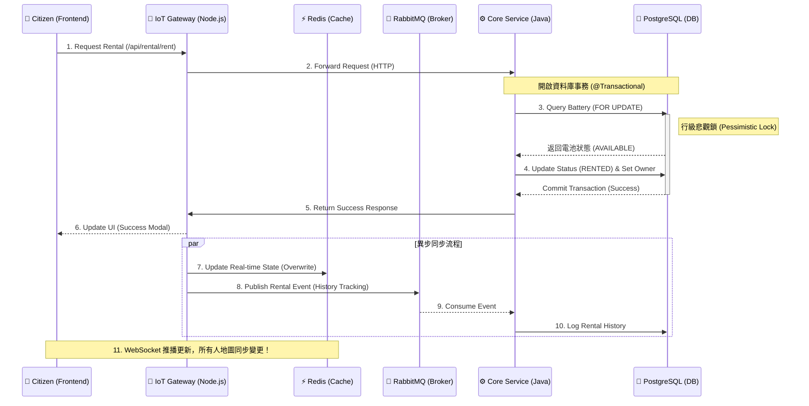

# 🔄 電池租借完整流程時序圖 (Battery Rental Sequence Diagram)

這份時序圖詳細解析了本專案最核心的業務邏輯：**「當一位市民租借電池時，系統內部發生了什麼？」**。這張圖能幫助您在面試時，對著白板清晰地講解數據如何在微服務間流轉。

---

## 🎨 業務流轉時序圖 (Mermaid)

---

## 🧩 關鍵技術點解析

1.  **為什麼要用 HTTP 轉發租借請求，而不是透過 MQ？**
    *   **原因**：租借是一個需要 **同步響應 (Synchronous Response)** 的操作。用戶點擊後需要立刻知道「成功」或「失敗」。MQ 適合「異步」任務（如：記錄日誌、發送通知），但不適合即時要求的交易回饋。
2.  **為什麼要在步驟 3 使用 `FOR UPDATE`？**
    *   **原因**：防止 **Lost Update (遺失更新)** 或 **Double Booking (雙重租借)**。如果在極短時間內有兩個人租借同一顆，沒有這把鎖，兩者可能都會查到 AVAILABLE，並同時改為 RENTED，造成資產衝突。
3.  **步驟 7 ~ 10 的異步設計有什麼意義？**
    *   **原因**：為了減輕主交易流程的負擔。更新歷史紀錄（Audit Log）與刷新儀表板快照不需要在同一個 Transaction 內完成，異步處理可以讓用戶感受到更快的響應速度。
