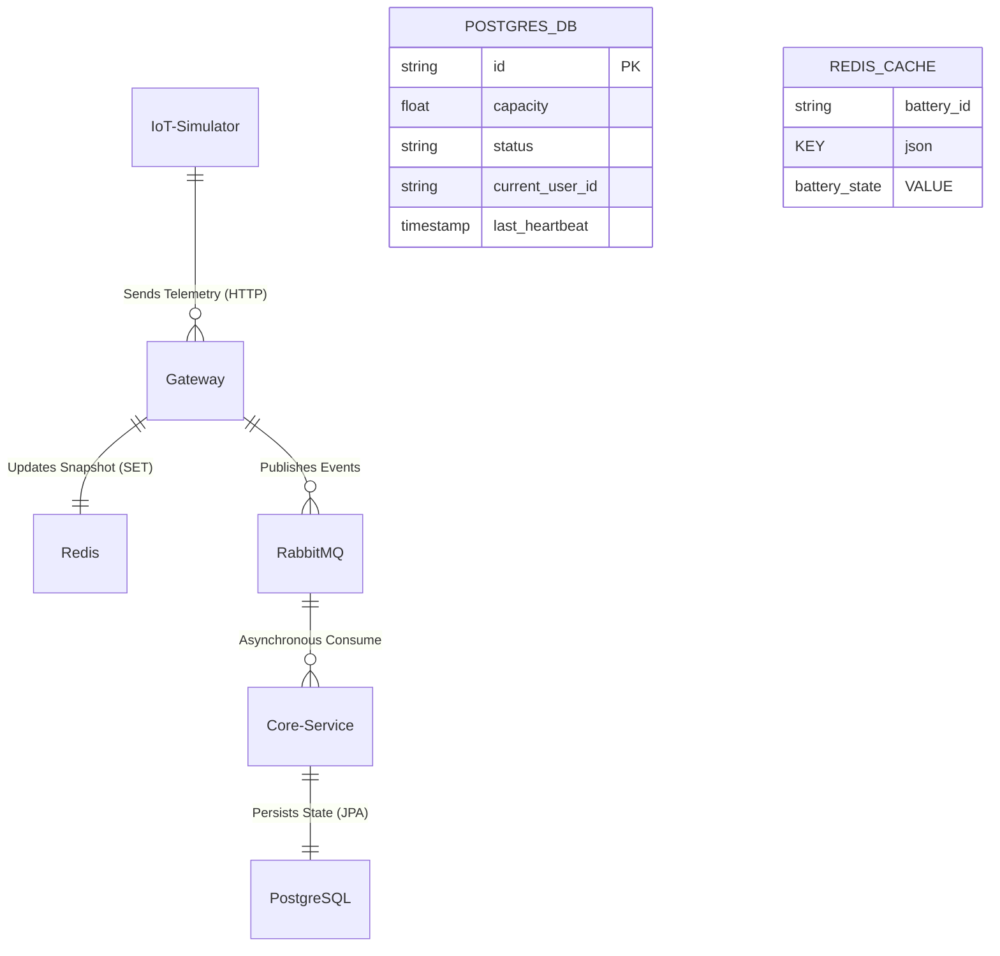

# 🗄️ 資料庫架構與數據模型 (Database Schema & Data Model)

本專案採用了「多樣性存儲 (Polyglot Persistence)」架構，根據數據的性質（暫態/狀態 vs. 永久/交易）分別使用了 Redis 與 PostgreSQL。

---

## 1. 關聯式架構 (PostgreSQL - 核心業務)

主要負責儲存具備 ACID 強一致性要求的數據。

### 📋 `batteries` 表 (資產主檔)
| 欄位名稱 (Column) | 類型 (Type) | 說明 (Description) | 平常操作 |
| :--- | :--- | :--- | :--- |
| **`id` (PK)** | VARCHAR(50) | 電池唯一識別碼 (如 BATT-0001) | 被 `FOR UPDATE` 鎖定 |
| `capacity` | DOUBLE | 當前剩餘容量 (0-100) | 歸還時更新 |
| `status` | VARCHAR(20) | 狀態 (AVAILABLE, RENTED, MAINTENANCE) | 租借/歸還時切換 |
| `current_user_id` | VARCHAR(100) | 當前租借者 ID (null 為無) | 租借時寫入 |
| `last_heartbeat` | TIMESTAMP | 最後一次接收遙測的時間 | 異步更新 |

### 🛠️ 索引 (Index) 策略
*   **Primary Key**: `id`（確保查詢與鎖定速度）
*   **Status Index**: 針對 `status` 欄位建立索引，最佳化「查詢附近可用電池」的性能。

---

## 2. 記憶體快取架構 (Redis - 即時監控)

主要負責存放數位孿生的「即時快照」，支撐前端地圖的毫秒級刷新。

### 🔑 `battery:{id}` (String/JSON)
*   **Key 格式**: `battery:BATT-0001`
*   **內容內容**:
    ```json
    {
      "id": "BATT-0001",
      "capacity": 85.5,
      "status": "AVAILABLE"
    }
    ```
*   **策略**: 無過期時間 (No TTL)，由 IoT Gateway 強制 Overwrite 最新值。

### 🔒 分散式鎖 (未來擴展預留)
*   **Key 格式**: `lock:battery:{id}`
*   **內容**: 租借者 UUID
*   **TTL**: 10 秒（防止死鎖）

---

## 3. 實體關聯圖 (Mermaid ER Diagram)



---

## 4. 數據流轉邏輯 (Data Life Cycle)

1.  **Ingestion**: 數據從網關進入，先寫入 **Redis**（保證前端讀取永遠是最新的熱數據）。
2.  **Buffering**: 網關將數據投送到 **RabbitMQ**。
3.  **Persistence**: 核心服務從隊列取出後，更新 **PostgreSQL**。
4.  **Transaction**: 用戶點擊租借，核心服務對 **PostgreSQL** 下悲觀鎖。成功後，異步同步更新 **Redis** 狀態，確保全系統 UI/UX 同步。
