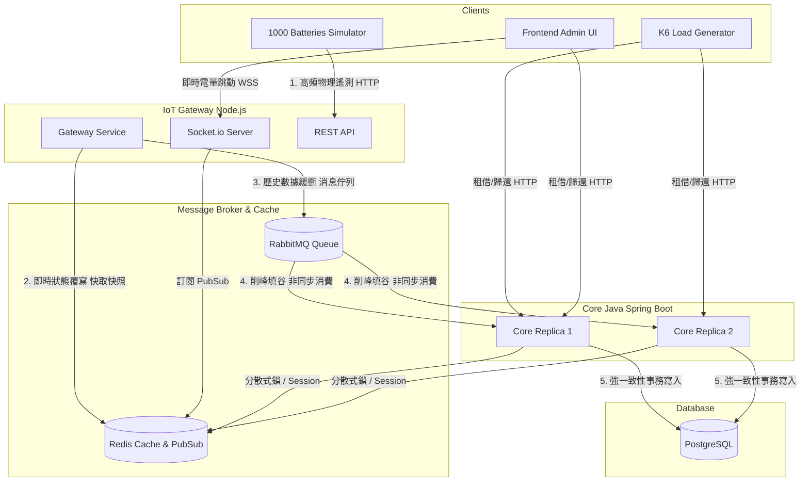

# 🔋 城市級電池數位孿生系統 (Urban Battery Digital Twin) 架構設計與實戰白皮書

## 1. 專案背景與應用情境

隨著共享微移動（如電動機車、共享單車）基礎設施的普及，如何大規模管理分散在地圖各處的能源資產成為一大挑戰。
本專案的目標是從 0 到 1 建構一個 **「城市級電池數位孿生 (Digital Twin) 系統」**。

*   **虛擬化物理世界**：將實體的電池資產（以 1,000 顆城市電池為基準）映射到數位空間。
*   **動態狀態模擬**：每顆電池擁有獨立的生命週期，持續發送「電量消耗」、「快充回血」的物理遙測數據，並具備「Available (待機)」與「Rented (租借中)」的商業狀態切換能力。
*   **核心價值**：本系統作為共享調度平台的前驅架構原型，主要為了驗證與解決物聯網 (IoT) 中最經典的問題：**「當海量的高頻物理數據，遇上強一致性的商業邏輯時，系統該如何設計才能避免崩潰與數據錯亂？」**

---

## 2. 系統架構與技術決策 (System Architecture & Tech Stack)

本系統採用 **微服務與事件驅動架構 (Event-Driven Architecture)**，並全面容器化部署於 Kubernetes 叢集，以達到高可用與水平擴展能力。

### 📊 系統架構圖

### 🧠 為什麼選擇這個技術棧？
這套架構組合並非偶然，而是針對不同場景特性的最佳化分工：

1.  **Node.js (IoT Gateway)**：
    Node.js 原生的事件迴圈 (Event Loop) 對於處理海量、輕量級的 I/O（如接收上千顆電池的遙測 API、推送 WebSocket 事件）具備極高的吞吐優勢，不耗費昂貴的執行緒資源。
2.  **Java Spring Boot (Core Service)**：
    對於牽涉到金錢或資產轉移的「商業邏輯」（如：租借確認、權限），需要嚴謹的型別、完善的事務管理 (ACID) 與成熟的套件生態。Spring Data JPA 與豐富的並發控制工具，讓它成為最穩固的後端防線。
3.  **Redis + Redisson**：
    我們不僅使用 Redis 取代資料庫應付首頁的頻繁刷新（快取），更利用它的 Pub/Sub 解決跨語言即時通訊，並利用 Redisson 實現了最關鍵的「分散式鎖」。
4.  **RabbitMQ**：
    物聯網的經典解藥。負責解耦與「削峰填谷」。如果不加它，一千顆電池同時寫入 SQL 會引發嚴重的 Database Lock；有了它，Core Service 就可以照自己的步調將電量歷史慢慢寫入資料庫。

---

## 3. 深入解析：核心微服務 (Core Microservices Deep Dive)

### 3.1 Core Service (控制中樞)
做為系統大腦，它不直接處理物聯網高頻的物理數據，而是專注於以下核心業務：
*   **RentalService (租借服務)**：接收用戶租借請求，檢查狀態、套用鎖定、並更新關聯庫。
*   **DataInitializer (防寫風暴初始化)**：負責在空資料庫啟動時播種 1000 筆基礎數據，且具備**嚴格的冪等性 (`count == 0`)**，確保 K8s 重啟副本時不會引發重複鍵崩潰。
*   **TelemetryConsumer (遙測消費者)**：作為 RabbitMQ 的後台聽眾，默默地將網關包裝好的電池損耗數據存檔作為長久歷史。

### 3.2 IoT Gateway (邊緣通訊網關)
它主要承擔了「數據分流與智慧合併」的功能，保護後端：
*  **智慧狀態合併 (Smart Merging)**：接收到實體模擬器傳來的電量數據後，會先查詢 Redis，確保它不會把 Core Service 剛寫入的 `RENTED` 狀態又給強行覆蓋回 `AVAILABLE`。
*  **雙鏈路輸出 (Dual Data Pipeline)**：一筆數據進來後，Gateway 高速分發：一條路塞進 Redis 並觸發 Socket 給前端；一條路打包扔進 RabbitMQ 就不管了（Fire and Forget）。

---

## 4. 關鍵專題：直擊 Race-Condition 與多實例併發防護

此專案最具技術含量的挑戰，在於如何在 Kubernetes 中驗證與防護「分散式狀態下的資料競爭 (Race Condition)」。

### 💥 情境與驗證方法
我們在 K8s 中部署了 **2 個 Core Service 副本 (Pod)**，連接**單一 PostgreSQL 實例**。接著，透過 K8s 部署 **k6 壓力測試工具 (Load Generator)**，模擬 20 個市民同時搜尋「空閒電池」並發起「租借」請求。
*   **災難浮現**：當兩個 K6 Virtual Users 同時選中 BATT-100 並向不同的 Core Pod 發起租借，兩個 Pod 同時讀取 SQL 發現該電池為 `AVAILABLE`，並同時執行 Update。結果就是電池被意外鎖死，或是噴出違反資料庫約束的報錯，導致系統癱瘓。

### 🛡️ 防禦機制的實踐
為了消除這種幻讀與髒寫，我們在三層架構中佈下了防禦：
1.  **應用層：Redisson 分散式鎖 (Distributed Lock)**
    在 `RentalService` 執行 `rentBattery()` 時，針對單顆電池 (`batteryId`) 向 Redis 申請互斥鎖。如果 Pod B 晚了幾毫秒，它必須等待 Pod A 完成事務釋放鎖，若超時則直接退回「已被租借」，確保單一電池永遠只有單一線程修改。
2.  **資料庫層：連線池調優 (HikariCP Optimizations)**
    我們將 `maximum-pool-size` 適當提升至 30。確保在 k6 海量產生租借競爭時，資料庫連線不會枯竭，為前端網頁的手動管理操作保留了一條「應急車道」。
3.  **基礎建設層 (K8s Resource Limits)**
    極端競爭會產生大量例外處理與物件，我們為 Core Service 設置了 `memory: 1Gi` 的明確資源限額界線，防止因 OOMKilled 引發 K8s 雪崩式的節點重啟。

---

## 5. 探索與除錯的 Prompting 洞察 (Prompting Insights)

回顧這段對話的推演過程，我們可以看見實用 AI 開發協作的一個標準「偵探式循環」：

1.  **逐步迭代法 (Iterative Scaling)**：
    沒有一開始就要求生出一個微服務集群。而是遵循 **單體代碼 -> 容器化打包 -> K8s YAML 配置 -> 負載壓力測試掛載** 的階梯式邁進。這種分解策略顯著降低了 AI 產生幻覺或複雜系統崩潰的機率。
2.  **證據驅動的對話 (Evidence-Based Debugging)**：
    當遇到 K8s 中的幽靈現象（如「電池電量不跳動了」），絕不使用猜測來對話。整個過程中深度依賴系統觀測指令：
    *   `kubectl describe pod` -> 定位 Exit Code，排除內存不足，指向代碼問題。
    *   `kubectl logs --previous` -> 抓出真實的 Java SQL Exception，識破 `DataInitializer` 重新佈署時引發的主鍵衝突。
    *   `rabbitmqctl list_queues` -> 從 RabbitMQ 實體查核隊列長度與消費者數量，發現那 1,860 則積壓訊息其實是因為網關「硬編碼了 localhost」導致的死胡同。
3.  **釐清數據流向**：
    當出現「為什麼畫面上租借行為正常，而 RabbitMQ 卻卡住不動？」的疑惑時，透過「同步業務流 (HTTP)」與「非同步遙測流 (AMQP)」的切割拆解，成功定位出問題僅限於資料寫入歷史庫的冷鏈路，保住了主要服務的可用性。

### 結語
這座建構在 Kubernetes 上的電池數位城市，現已具備了抗壓、高併發保護與微服務解耦的現代化雲原生架構特徵。這是一場涵蓋了網路拓樸、鎖定機制與 K8s 調度的精彩實戰演練！
