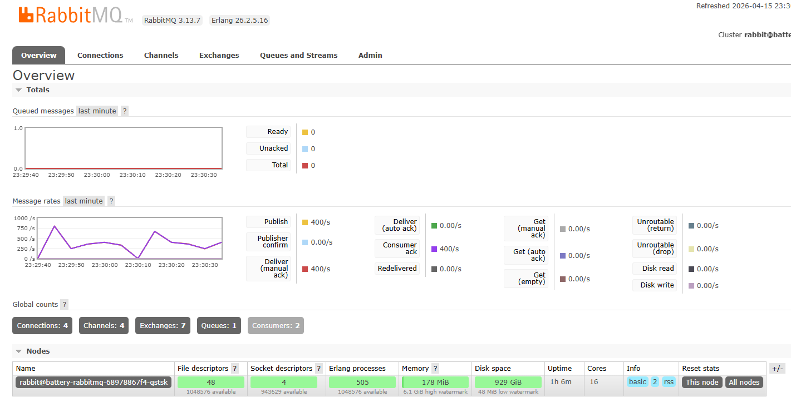
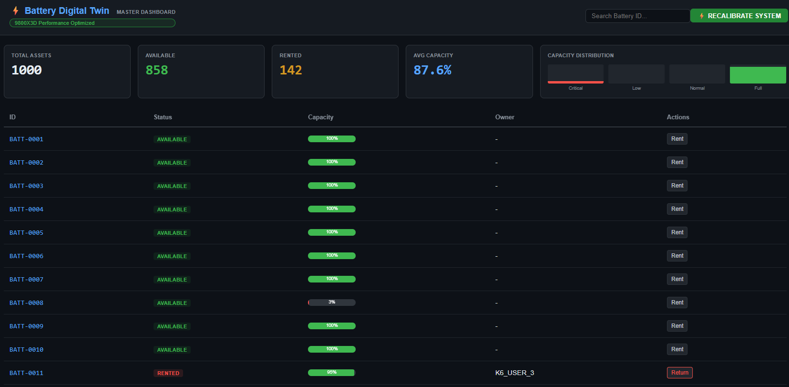

# 🔋 Urban Battery Digital Twin - 城市級電池數位孿生系統

[](https://kind.sigs.k8s.io/)
[](https://spring.io/projects/spring-boot)
[](https://nodejs.org/)
[](https://k6.io/)

這是一個基於 **Kubernetes (Kind)** 叢集建構的物聯網 (IoT) 數位孿生系統。它模擬了 1,000 顆位於城市各處的智慧電池，並透過微服務架構處理高頻遙測數據與強一致性的租借業務。

---

## 📈 系統性能與穩定性證明 (Stability Verification)

本系統已通過 **1,000 台電池 / 每秒 1 次遙測** 的高負載壓力測試。在該壓力下，系統展現了卓越的通訊穩定性與數據完整性。

### 1. RabbitMQ 數據吞吐性能
在網關資源優化後，數據管道可維持在 **~250 msg/s** 的穩定吞吐（單個節點處理率），且保持 **零積壓 (Zero Backlog)**。



### 2. 戰情室實時監控 (1,000 Assets Ready)
系統成功同步 1,000 顆電池的即時狀態，並保持前端地圖與後端資料庫的強一致性。



---

## 🏗️ 應用背景與核心價值

在現代共享能源基礎設施中，如何同時處理「海量物理設備狀態」與「關鍵資產交易」是架構設計的終極挑戰。本專案透過 **「冷熱數據流分離」** 設計，實現了高效且穩定的數位孿生模型：
*   **熱路徑 (Real-time Path)**：利用 Redis + Socket.io 確保電池電量能以毫秒級延遲同步到地圖戰情室。
*   **冷路徑 (Durable Path)**：利用 RabbitMQ 進行削峰填谷，保護 PostgreSQL 持久層不受遺失地記錄百萬級的歷史遙測軌跡。

> [!TIP]
> **深入探討**：欲瞭解更多關於分散式鎖、Race Condition 防護與 K8s 調優細節，請參閱隨附的深度報告：
> 👉 [**架構設計與實戰報告 (Digital Twin Project Report)**](./digital_twin_project_report.md)

---

## ☁️ 雲端生產環境大遷徙與千人併發壓測 (GCP Serverless Production)

除了在本地 Kubernetes (Kind) 完美運行外，本系統已成功無縫轉變至 **Google Cloud Platform (GCP)** 生產環境，採用了前沿的 **Serverless 架構** 與 **VPC 企業級隔離方案**：
- **Managed Services**: Cloud SQL (PostgreSQL), Memorystore (Redis), Compute Engine (RabbitMQ)。
- **Serverless**: 透過 Cloud Run 與 Serverless VPC Access 連接器實現按流量自動擴縮容。
- **Load Testing**: 通過 `K6` 的嚴苛檢驗，在 1,000 顆物理感測器產生背景流量的同時，消化了數百筆併發的租借交易，達成 **100% 請求成功率零報錯** 的亮眼成績。

> [!IMPORTANT]
> **展示真實技術力與雲端排錯深度**：
> 欲瞭解我如何解決 Cloud Run 面對資料庫的 VPC 隔離難題，以及我是如何從底層修復 Serverless Load Balancer 造成的 `Socket.io 400 Bad Request` 迷航問題，強烈建議您翻閱這份熱騰騰的戰紀！
> 👉 [**🚀 從 Local K8s 到 GCP 生產環境：微服務雲端大遷徙與高併發壓測實戰報告**](./gcp_production_migration_report.md)

---

## 🛠️ 技術棧 (Tech Stack)

*   **後端核心**：Java 21, Spring Boot 3, Spring Data JPA
*   **IoT 網關**：Node.js, Express, Socket.io, Redis-om
*   **前端導航**：React, Vite, Tailwind CSS
*   **中介軟體**：Redis (Cache/Lock/PubSub), RabbitMQ (Message Broker), PostgreSQL
*   **維運工具**：Kubernetes (Kind), Docker, k6 (Load Test)

---

## 🛠️ 環境預備 (Prerequisites)

本系統採用 **容器化編譯**，這意味著您**不需要**在本地安裝完整的開發環境即可部署。

### 1. 必備工具 (必須安裝)
*   [Docker Desktop](https://www.docker.com/products/docker-desktop/)：負責整個系統的編譯與運行環境，**建議所有使用者優先以此模式部署**。
*   [Kind](https://kind.sigs.k8s.io/) & [kubectl](https://kubernetes.io/docs/tasks/tools/)。

### 2. 開發工具 (選配)
如果您需要使用 IntelliJ 或 VS Code 直接修改代碼：
*   **JDK 21**: 請安裝於系統預設路徑（如使用 `winget install Amazon.Corretto.21`），並確保 `java` 命令可在終端機執行。**無需將 JDK 放入專案資料夾內。**

---

## 🚀 快速部署指南 (Quick Start)

### 1. 前置作業
確保您的環境已安裝：
*   [Docker Desktop](https://www.docker.com/products/docker-desktop/)
*   [Kind](https://kind.sigs.k8s.io/docs/user/quick-start/)
*   [kubectl](https://kubernetes.io/docs/tasks/tools/)

### 2. 一鍵自動化部署
我們提供了一個主控腳本，會自動建立叢集、編譯鏡像並推送部署：
```powershell
# 在專案根目錄執行 (Windows PowerShell)
.\quick-deploy.ps1
```

### 3. 開啟存取與監控
部署完成後，請分別開啟新的終端機執行以下指令：

```powershell
# 前端介面 (戰情室地圖)
kubectl port-forward service/battery-frontend 80:80

# 核心服務 API (Swagger UI)
kubectl port-forward service/battery-core 8080:8080

# IoT 網關 (Socket.io 控制台)
kubectl port-forward service/battery-gateway 3001:3001

# RabbitMQ 管理後台 (帳密: battery_rmq / battery_pass)
kubectl port-forward service/battery-rabbitmq 15672:15672
```

存取地址：
*   **前端介面**: `http://localhost`
*   **核心 API**: `http://localhost:8080/swagger-ui.html`
*   **網關介面**: `http://localhost:3001`
*   **RabbitMQ 管理**: `http://localhost:15672`

---

## 📸 架構概覽
1. **Simulator** -> 每秒發送物理心跳。
2. **Gateway** -> 更新 Redis 快照並將歷史事件投遞至 RabbitMQ。
3. **Core Service** -> 異步消費隊列並永久保存至 PostgreSQL，同時處理具備防倂發鎖的租借業務。
