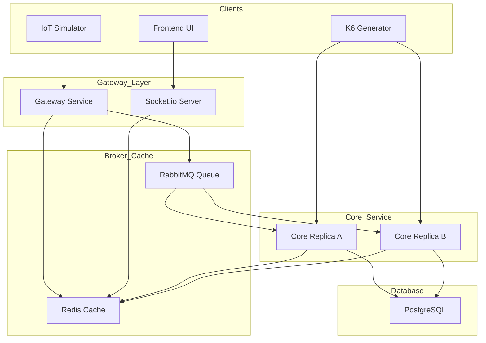

# 🔋 城市級電池數位孿生系統 (Urban Battery Digital Twin) 架構設計與實戰白皮書

## 1. 專案背景與應用情境

隨著共享微移動設施的普及，如何大規模管理分散在地圖各處的能源資產成為一大挑戰。本專案從 0 到 1 建構了一個「城市級電池數位孿生系統」。

*   **核心價值**：本系統作為共享調度平台的前驅架構原型，主要為了驗證與解決物聯網 (IoT) 中最經典的問題：**「當海量的高頻物理數據，遇上強一致性的商業邏輯時，系統該如何設計才能避免崩潰與數據錯亂？」**

---

## 2. 系統架構與技術決策 (System Architecture & Tech Stack)

本系統採用微服務與事件驅動架構，並容器化部署於 Kubernetes 叢集。

### 📊 系統架構圖 (與 K8s 元件對齊)

> [!NOTE]
> 如果您無法看到下方的圖表，請確保您的 Markdown 閱讀器支援 Mermaid（例如 VS Code 需安裝 "Markdown Preview Mermaid Support" 擴充套件）。

---

## 3. 架構探討：深入理解各組件的設計初衷 (Q&A)

### Q1: 為什麼 Core Java Spring Boot 需要部署到「兩個」副本？
主要為了驗證 **「分散式鎖 (Distributed Lock)」**。在 K8s 雙實例環境下，我們被迫使用 Redis/Redisson 來協調對同一筆 SQL 資料的併發寫入。如果是單機，我們用線程鎖即可，無法模擬真實的分散式競爭。

### Q2: Redis 的 Pub/Sub 在這裡扮演什麼角色？
它是一個 **「廣播機制」**。當管理者按下「系統重置」時，Java 會將訊號發入 Redis，所有網關 Pod 會瞬間同步透過 Socket.io 通知瀏覽器，解決了跨服務通知的問題。

### Q3: RabbitMQ 的分工是什麼？它是用來監看電量嗎？
**不，它是系統的「護城河」。** 
*   **RabbitMQ (削峰填谷)**：在高頻遙測數據湧入時，先將其放入隊列。核心服務依自己的步調讀取並更新 SQL。
*   **PostgreSQL (最終真理)**：保存所有不可竄改的商業資料（如租借記錄、長期歷史軌跡）。
*   **Redis (即時快照)**：負責應付前端畫面每一秒的即時更新需求。

### Q4: [面試官深度詰問] Redis(熱) 與 Postgres(冷) 數據不一致怎麼辦？
這涉及 **最終一致性 (Eventual Consistency)**。我們優先保證 Redis 顯示的及時性用於觀察。如果 Postgres 因極端情況沒跟上，我們會實施 **Read-through 策略**：當 Redis 無法讀取時，強制從 Postgres 恢復最可靠的狀態，並重新同步至 Redis。

### Q5: [面試官深度詰問] 如果電池數量增加到 100 萬顆，瓶頸在哪？
瓶頸在於 **網關單點連線數** 與 **Redis 的寫入頻率**。解決方案包括：1. **Gateway Sharding** (利用 K8s HPA 擴展)；2. **Redis Cluster** (依照電池 ID 進行分區寫入)；3. 在 RabbitMQ 階段進行 **批處理寫入 (Batching)**。

### Q6: [面試官深度詰問] 消息從 RabbitMQ 領出但寫入失敗，數據會丟失嗎？
**不會。** 我們開啟了 **手動確認 (Manual ACK)**。如果資料庫寫入失敗，訊息會回到 **死信隊列 (DLQ)**，管理員可以針對異常進行人工補償。

### Q7: [面試官深度詰問] 如何確保跨服務租約交易的原子性？
目前的防線是 **分散式鎖**。若要更進階，可考慮 **Saga Pattern (補償事務)** 或 **發件箱模式 (Outbox Pattern)**：將「SQL 更新」與「事件發送」繫在同一個資料庫事務中。

### Q8: [面試官深度詰問] 既然資料庫已初始化 1000 筆電池，為什麼還要用 Simulator？
這涉及到 **「身分 (Identity)」與「生命 (Life)」** 的區別：
*   **PostgreSQL (身分發放)**：負責定義身分證（ID、型號）。如果沒有它，網關收到的數據將無法關聯到任何存在的資產。
*   **Simulator (物理行為)**：負責模擬真實世界中的 **BMS (電池管理系統)**。在 IoT 架構中，資料庫是被動的，必須由實體設備主動發送「遙測訊號」跨越網路進入雲端。
*   **實戰意義**：使用 Simulator 才能真正測試「網路延遲」、「網關吞吐」與「隊列緩衝」等真實 IoT 場景。如果直接用 SQL 任務改數字，就失去了驗證分散式架構高併發能力的意義。

---

## 4. 關鍵專題：直擊 Race-Condition 與多實例併發防護

### 💥 情境與災難
我們啟用了 **k6 (20個虛擬併發市民)**。當兩個 K6 User 同時看上 `BATT-100` 並向不同的 Core Replica 發起租借請求時，會引發 `DataIntegrityViolationException` 或電池被租借兩次的報錯。

### 🛡️ 三道防護陣列
1.  **應用層：Redisson 分散式鎖**：針對電池 ID 申請互斥鎖，確保單一資源絕對排他。
2.  **資料庫層：HikariCP 調優**：將 `maximum-pool-size` 提升至 30，為管理操作保留連線連車道。
3.  **架構層：嚴格的冪等性**：使用 `count == 0` 作為初始化唯一鎖鑰，確保 K8s 重啟副本時的穩定。

---

## 5. 探索與除錯的 Prompting 洞察

1.  **逐步迭代 (Iterative Scaling)**：遵循「物理代碼 -> 容器化 -> K8s」的進程。
2.  **證據驅動 (Evidence-Based Debugging)**：利用 `kubectl describe`、`logs --previous` 與 `rabbitmqctl` 識破地雷。
3.  **精準切割**：將系統切割為「同步商業」與「非同步遙測」兩條線，實現微服務解耦。
