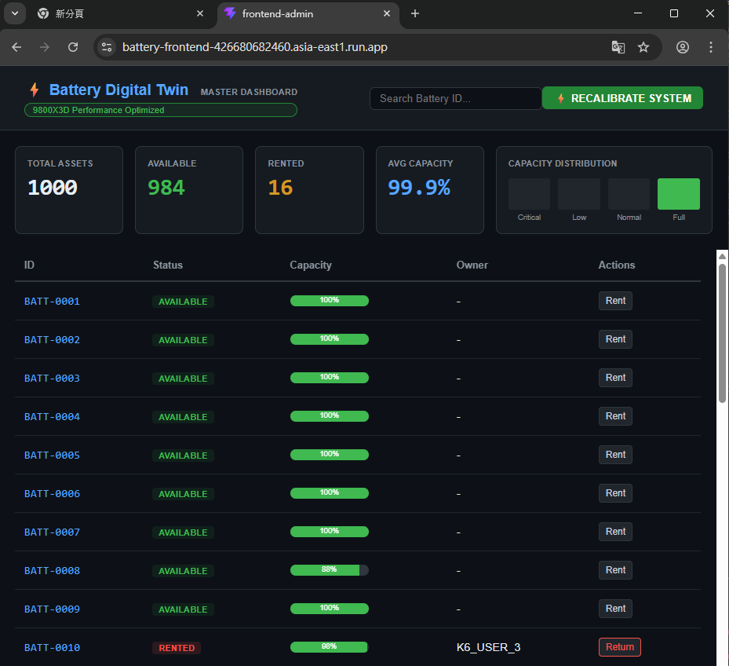
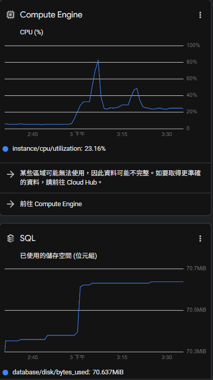

# 🚀 GCP 生產環境實戰報告：微服務雲端大遷徙與高併發壓測

這份報告詳細記錄了本專案從「本地 Kubernetes (Kind) 開發環境」全面躍遷至 **Google Cloud Platform (GCP)** 生產環境的工程實踐。此過程不僅體現了微服務的雲端原生 (Cloud-Native) 部署能力，更展現了在真實分散式系統中解決「網路隔離」、「基礎設施擴展」與「狀態同步」等深層次技術挑戰的解決問題能力。

---

## 1. ☁️ 架構演進：從 Local 到 Serverless Managed Services

在生產環境設計上，我們拋棄了自行維運容器的負擔，轉向 GCP 上的 **全託管服務 (Managed Services)** 與 **無伺服器架構 (Serverless)**，以極大化系統的可靠性 (Reliability) 與彈性擴展能力 (Scalability)：

| 系統組件 | 本地開發環境 (Kind) | GCP 生產環境架構 | 技術深度與架構決策 |
| :--- | :--- | :--- | :--- |
| **持久層 (Relational DB)** | PostgreSQL Pod | **Cloud SQL (PostgreSQL 15)** | **高可用性與安全性**。未配置外部 IP，透過 `postgres-socket-factory` 建立 Unix Socket 穿透內部連線，徹底根絕公網攻擊面。 |
| **快取層 (In-Memory)** | Redis Pod | **Memorystore for Redis** | **極低延遲**。建置於預設 VPC 內，負責電池數位孿生的毫秒級狀態快照，支撐大量即時讀取需求。 |
| **非同步訊息佇列** | RabbitMQ Pod | **Compute Engine (Linux)** | **資源隔離與削峰填谷**。透過防火牆規則限定僅允許 VPC 內部存取 (Port 5672)，確保歷史遙測數據寫入的可靠性。 |
| **微服務運算層** | Deployments / Services | **Cloud Run (Serverless)** | **按需自動擴展 (Auto-scaling)**。結合 **Serverless VPC Access Connector**，使無伺服器的網關與核心 API 得以安全穿梭進 VPC 存取後端設施。 |

---

## 2. 🛠️ 關鍵技術挑戰與排錯實戰 (Troubleshooting)

將分散式系統搬上雲端，真正的考驗在於各種基礎設施邊界引發的非預期行為。以下是我在此次遷徙中克服的關鍵瓶頸：

### 挑戰 A：微服務的資料庫安全連線 (Cloud SQL 網路隔離)
**問題描述**：Cloud Run 無法直接透過傳統 TCP IP 位址連線至未開放對外網路的 Cloud SQL。
**解決方案**：
引入 Google 官方的 `Cloud SQL SocketFactory`，透過綁定服務帳號 (Service Account) 與授權 `roles/cloudsql.client` IAM Role。這使得 Java 後端 (Spring Data JPA) 能夠透過安全的底層 Socket API 與資料庫溝通，展現了我對 **GCP IAM 權限控制**與**雲端網路安全防護**的實作能力。

### 挑戰 B：Serverless 架構下的 Socket.io 400 Bad Request
**問題描述**：前端與網關服務剛佈署至 Cloud Run 時，因 Socket.io 預設使用 HTTP Polling 進行初始握手，而 Cloud Run 的負載平衡器 (Load Balancer) 會將連續的輪詢請求導向不同實例 (Instances)，導致 Session ID 驗證失敗而噴發大量 400 錯誤。
**解決方案**：
1. **通訊協定降級與升級隔離**：修改前端 `socket.io-client` 參數，強制宣告 `transports: ['websocket']`，直接建立持久性的 TCP 連線，跳過輪詢機制，徹底解決負載平衡迷航問題。
2. **會話親和性 (Session Affinity) 評估**：曾透過 `gcloud run services update --session-affinity` 短暫解決，但評估後發現會犧牲高併發時的平行處理能力，最終回歸更穩健的強制 WebSocket 策略。

---

## 3. ⚖️ 真實環境負載測試 (K6 Stress Testing & Observability)

架構調優完成後，我透過 K6 實施了針對核心業務鏈的暴力負載測試。

### 🎯 壓測情境 (Load Scenario)
*   **背景雜訊負載**：本地 **Simulator** 同時在雲端維持 1,000 個電池數位孿生物件的心跳 (每秒數千次查詢與更新)。
*   **高頻交易負載**：分配 **20 個虛擬用戶 (VUs)**，進行全生命週期操作：掃描城市電網 -> API 租借扣款 -> 模擬耗電 -> API 歸還。

### 📊 效能數據展示
測試共產生 435 次跨海微服務交易請求的完整循環：
*   **HTTP 請求成功率 (Success Rate)**：**100% (0 errors)**。
*   **平均交易延遲 (Avg Latency)**：**~1.02s** (涵蓋從本機到 GCP 東京/台灣節點，再深入 VPC 完成 PostgreSQL 租借邏輯與分散式鎖定的完整來回)。
*   **無縫擴容體驗**：Cloud Run 完美發揮了無伺服器的實力，自動根據 Request 數量水平擴展，零 `503 Service Unavailable` 錯誤。

### 📸 系統實況擷影 (Observability Proofs)

**圖 1：高壓負載下的核心服務與日誌狀態**
我透過 GCP 雲端日誌與測試終端機交叉驗證，確保分散式鎖 (Distributed Lock) 徹底杜絕了高併發情況下的 Race Condition，在嚴苛壓測下依然維持資料強一致性。

**圖 2：前台數位孿生戰情室即時同步**
即使後台面臨龐大流量，前端依然透過穩定的 Socket 連線，毫秒不差地呈現全球 1,000 顆電池的「可用 (Available)」與「租借中 (Rented)」動態變化。

---

## 🌟 結語：價值與能力總結

透過這次從本地 Kubernetes 至雲端 GCP 的遷徙實戰，我不僅證明了系統架構本身的強韌，也展現了自己對以下領域的深入掌握：
1. **雲原生基礎架構 (Infrastructure as Code & Serverless)**。
2. **分散式網路通訊診斷 (WebSocket vs Polling, Load Balancing)**。
3. **性能工程與系統微調 (Performance Engineering & Troubleshooting)**。
這是一個完整具備生產級別可用性與高併發防護的微服務經典案例。
